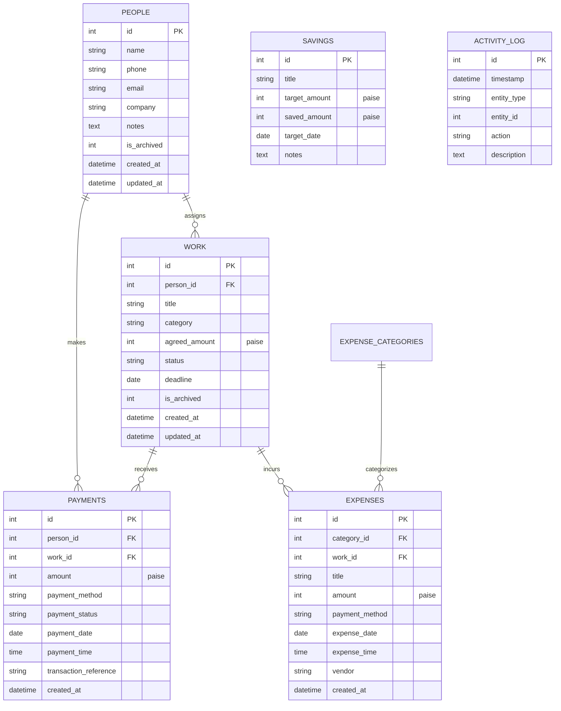

# VCE Work & Money Flow Tracker — Database Architecture & Schema

The application uses **SQLite 3** as its single, authoritative source of truth located at:
```
database/vce.db
```

---

## 1. Engine Configuration
- **Journal Mode**: `WAL` (Write-Ahead Logging) for high concurrency and fast crash recovery.
- **Foreign Keys**: `PRAGMA foreign_keys = ON;` strictly enforced.
- **Busy Timeout**: 5000ms.

---

## 2. Relational Schema Diagram



---

## 3. Money Representation Rule
All monetary values (`agreed_amount`, `amount`, `target_amount`, `saved_amount`) are stored as **integers representing paise** ($100\text{ paise} = \text{₹}1.00$).
This avoids IEEE-754 floating-point truncation issues.

---

## 4. Performance Indexes
- `idx_people_name` on `people(name)`
- `idx_people_phone` on `people(phone)`
- `idx_work_person_id` on `work(person_id)`
- `idx_work_status` on `work(status)`
- `idx_work_deadline` on `work(deadline)`
- `idx_payments_person_id` on `payments(person_id)`
- `idx_payments_work_id` on `payments(work_id)`
- `idx_payments_method` on `payments(payment_method)`
- `idx_payments_date` on `payments(payment_date)`
- `idx_payments_amount` on `payments(amount)`
- `idx_expenses_date` on `expenses(expense_date)`
- `idx_expenses_amount` on `expenses(amount)`
